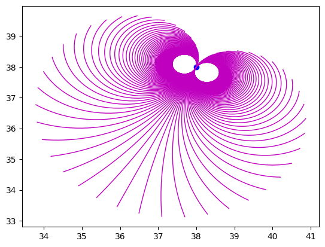

# Fast TTC (Time to Collision) in Fortran and Python bindings

This repository implements TTC algorithm in a numerically efficient form in **Fortran**, with **Python** Bindings.

This further includes a **cython** implementations of forward propagating TTC controlled robot with scipy optimisation.

## Control dynamics of the unicycle robot dynamics

## Rollout of robot with TTC within a crowd

